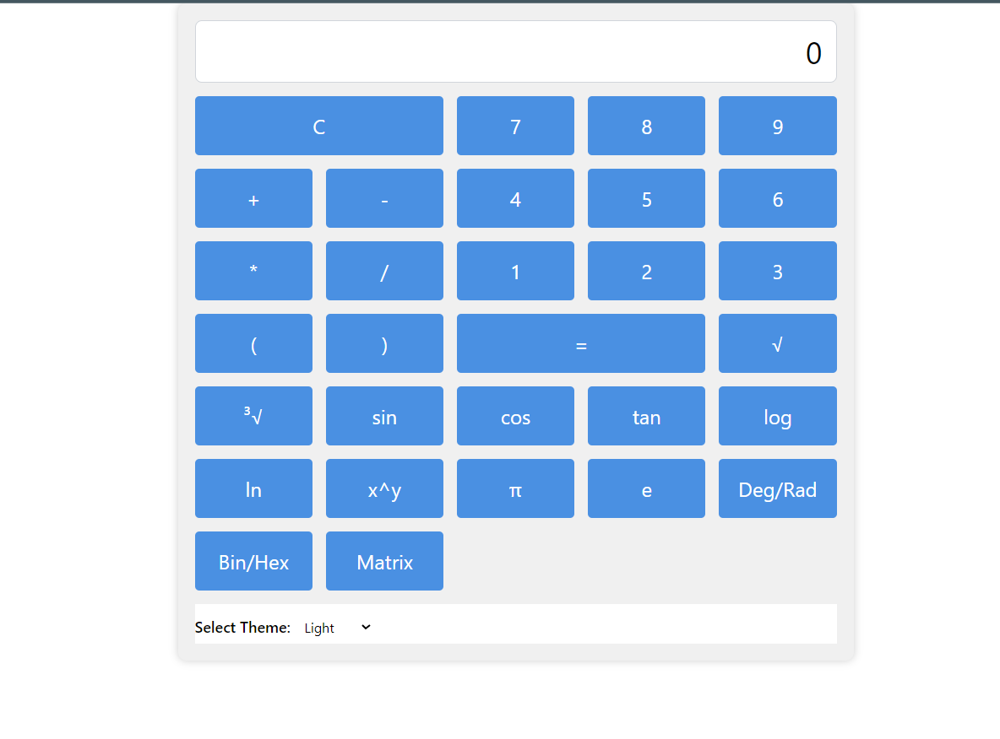
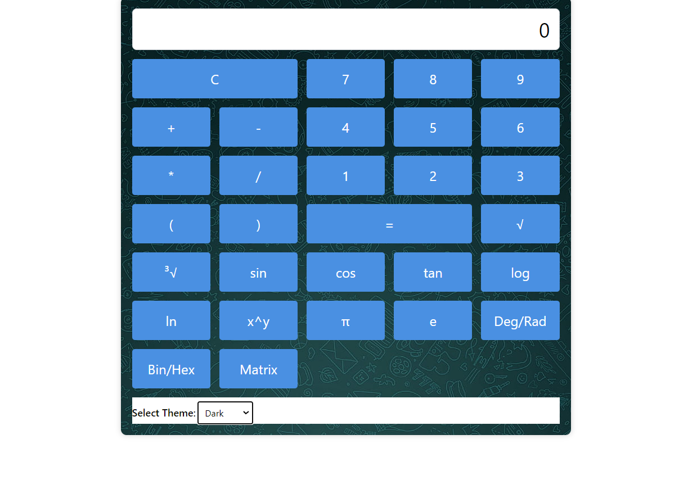

# Scientific Calculator by Kashif Raza

A web-based scientific calculator developed using HTML, CSS, and JavaScript.

## Table of Contents

- [Demo](#demo)
- [Features](#features)
- [Screenshots](#screenshots)
- [Author](#author)
- [Getting Started](#getting-started)
- [License](#license)

# Demo

You can try out the calculator by visiting the [live demo](https://altkriz.github.io/calc).

# Features

- Basic arithmetic operations (addition, subtraction, multiplication, division).
- Advanced functions for scientific calculations.
- User-friendly and responsive design.

# Screenshots






# Author

- [Kashif Raza](https://github/altkriz)

# Getting Started

To run this calculator locally, follow these steps:

1. Clone the repository:

   ```sh
   git clone https://github.com/altkriz/calc.git
